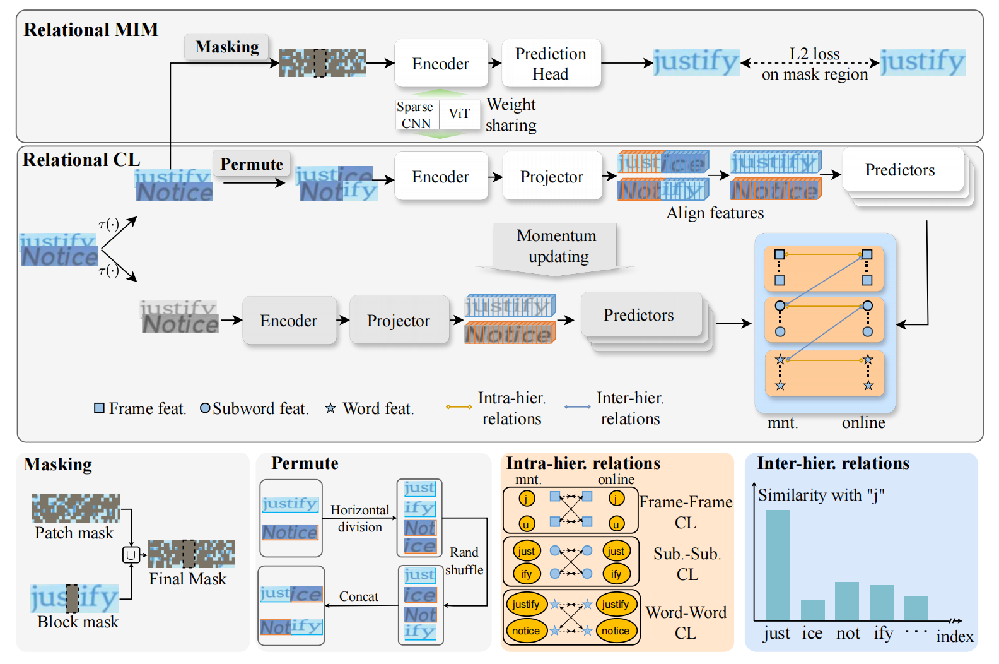

# Relational Contrastive Learning and Masked Image Modeling for Scene Text Recognition

[Tiancheng Lin]()*1, [Jinglei Zhang]()*1, [Yi Xu]()†1, [Kai Chen]()1, [Rui Zhang]()1, [Chang-Wen Chen]()2 

1MoE Key Lab of Artificial Intelligence, AI Institute, Shanghai Jiao Tong University  
2Hong Kong Polytechnic University

Code is coming soon.